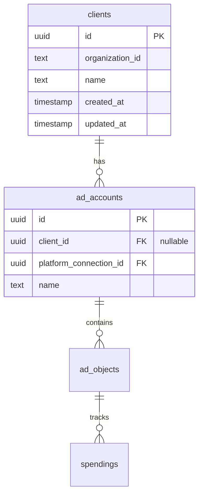

# feat: Client Entity - Bundle Ad Accounts under Clients (Simplified)

## Overview

Users need to group Ad Accounts under **Clients** for organized dashboard views. A Client is a simple label/grouping that belongs to an organization.

**Relationship:** One-to-many. Each AdAccount belongs to one Client (or none). Each Client has many AdAccounts.

**Source:** [Notion Feature Spec](https://www.notion.so/imrl/Client-Entity-Bundle-Ad-Accounts-under-Clients-2d7e038049d98181a520e1d1fa70089e)

---

## Problem Statement

AdAccounts exist as standalone entities. Users managing campaigns for multiple clients need to group accounts by client/brand for aggregated spending views on the dashboard.

---

## Proposed Solution (Simplified)

Based on reviewer feedback, this plan uses the simplest approach that delivers value:

### Data Model



**Key simplification:** No junction table. Just add `client_id` FK to existing `ad_accounts` table.

---

## Technical Approach

### Phase 1: Database + API

**Schema Changes:**

```typescript
// packages/database/src/schema/boris.ts

// NEW: clients table
export const clients = pgTable(
  'clients',
  {
    id: uuid('id').defaultRandom().primaryKey(),
    organizationId: text('organization_id').notNull(),
    name: text('name').notNull(),
    createdAt: timestamp('created_at', { withTimezone: true }).defaultNow().notNull(),
    updatedAt: timestamp('updated_at', { withTimezone: true }).defaultNow().notNull(),
  },
  (table) => [
    index('clients_organization_idx').on(table.organizationId),
    unique('clients_org_name_unique').on(table.organizationId, table.name),
  ],
);

// MODIFY: add client_id to ad_accounts
export const adAccounts = pgTable(
  'ad_accounts',
  {
    // ... existing fields ...
    clientId: uuid('client_id').references(() => clients.id, { onDelete: 'set null' }),
  },
  // ... existing constraints ...
);

// Relations
export const clientsRelations = relations(clients, ({ many }) => ({
  adAccounts: many(adAccounts),
}));

// Update adAccountsRelations
export const adAccountsRelations = relations(adAccounts, ({ one, many }) => ({
  client: one(clients, {
    fields: [adAccounts.clientId],
    references: [clients.id],
  }),
  // ... existing relations ...
}));
```

**API Endpoints:**

| Method | Endpoint | Description |
|--------|----------|-------------|
| `GET` | `/api/clients` | List clients with account counts |
| `POST` | `/api/clients` | Create client |
| `PATCH` | `/api/clients/:id` | Update client name |
| `DELETE` | `/api/clients/:id` | Delete client (accounts get `client_id = null`) |

**Route Implementation:**

```typescript
// apps/api/src/routes/clients.ts

import { Router } from 'express';
import { z } from 'zod';
import { asyncHandler } from '../lib/async-handler.js';
import { db, clients, adAccounts, eq, sql } from '@boris/database';

export const clientsRouter = Router();

const createClientSchema = z.object({
  name: z.string().min(1).max(255),
});

// GET /api/clients
clientsRouter.get('/', asyncHandler(async (req, res) => {
  const orgId = req.auth.orgId; // From Clerk

  const result = await db
    .select({
      id: clients.id,
      name: clients.name,
      accountCount: sql<number>`count(${adAccounts.id})::int`,
      createdAt: clients.createdAt,
    })
    .from(clients)
    .leftJoin(adAccounts, eq(clients.id, adAccounts.clientId))
    .where(eq(clients.organizationId, orgId))
    .groupBy(clients.id)
    .orderBy(clients.name);

  res.json({ data: result });
}));

// POST /api/clients
clientsRouter.post('/', asyncHandler(async (req, res) => {
  const orgId = req.auth.orgId;
  const { name } = createClientSchema.parse(req.body);

  const [client] = await db
    .insert(clients)
    .values({ name, organizationId: orgId })
    .returning();

  res.status(201).json({ data: client });
}));

// PATCH /api/clients/:id
clientsRouter.patch('/:id', asyncHandler(async (req, res) => {
  const { name } = createClientSchema.parse(req.body);

  const [client] = await db
    .update(clients)
    .set({ name, updatedAt: new Date() })
    .where(eq(clients.id, req.params.id))
    .returning();

  if (!client) throw new NotFoundError('Client not found');
  res.json({ data: client });
}));

// DELETE /api/clients/:id
clientsRouter.delete('/:id', asyncHandler(async (req, res) => {
  await db.delete(clients).where(eq(clients.id, req.params.id));
  res.status(204).send();
}));
```

**Add to AdAccounts route - update client assignment:**

```typescript
// apps/api/src/routes/ad-accounts.ts (add to existing)

const updateAccountSchema = z.object({
  clientId: z.string().uuid().nullable(),
});

adAccountsRouter.patch('/:id', asyncHandler(async (req, res) => {
  const { clientId } = updateAccountSchema.parse(req.body);

  const [account] = await db
    .update(adAccounts)
    .set({ clientId, updatedAt: new Date() })
    .where(eq(adAccounts.id, req.params.id))
    .returning();

  if (!account) throw new NotFoundError('Account not found');
  res.json({ data: account });
}));
```

### Phase 2: Frontend + Dashboard

**Single Clients Page:**

```typescript
// apps/web/app/routes/clients.tsx

import { useLoaderData, useFetcher } from 'react-router';
import { useState } from 'react';

export async function loader() {
  const res = await fetch(`${API_URL}/api/clients`, { credentials: 'include' });
  return res.json();
}

export async function action({ request }) {
  const formData = await request.formData();
  const intent = formData.get('intent');

  if (intent === 'create') {
    await fetch(`${API_URL}/api/clients`, {
      method: 'POST',
      headers: { 'Content-Type': 'application/json' },
      body: JSON.stringify({ name: formData.get('name') }),
      credentials: 'include',
    });
  }

  if (intent === 'delete') {
    await fetch(`${API_URL}/api/clients/${formData.get('id')}`, {
      method: 'DELETE',
      credentials: 'include',
    });
  }

  return null;
}

export default function Clients() {
  const { data: clients } = useLoaderData();
  const fetcher = useFetcher();
  const [newName, setNewName] = useState('');

  if (clients.length === 0) {
    return (
      <div className="text-center py-16">
        <h2>No clients yet</h2>
        <p>Create your first client to organize ad accounts.</p>
        {/* Inline create form */}
      </div>
    );
  }

  return (
    <div>
      <h1>Clients</h1>

      {/* Inline create form */}
      <fetcher.Form method="post" className="mb-6">
        <input type="hidden" name="intent" value="create" />
        <input
          name="name"
          placeholder="New client name"
          value={newName}
          onChange={(e) => setNewName(e.target.value)}
        />
        <button type="submit">Create</button>
      </fetcher.Form>

      {/* Client list */}
      <div className="space-y-2">
        {clients.map((client) => (
          <div key={client.id} className="flex items-center justify-between p-4 border rounded">
            <div>
              <span className="font-medium">{client.name}</span>
              <span className="text-muted-foreground ml-2">
                {client.accountCount} accounts
              </span>
            </div>
            <fetcher.Form method="post">
              <input type="hidden" name="intent" value="delete" />
              <input type="hidden" name="id" value={client.id} />
              <button type="submit" onClick={(e) => {
                if (!confirm(`Delete ${client.name}?`)) e.preventDefault();
              }}>
                Delete
              </button>
            </fetcher.Form>
          </div>
        ))}
      </div>
    </div>
  );
}
```

**Dashboard Integration:**

Extend existing dashboard query to include client info and allow grouping:

```typescript
// packages/database/src/queries/analytics.ts (modify existing)

export async function getAccountsWithSpending(
  startDate: Date,
  endDate: Date,
  organizationId: string,
): Promise<AccountWithSpending[]> {
  const latestSpendings = latestSpendingsSubquery(startDate, endDate);

  const results = await db
    .select({
      id: adAccounts.id,
      name: adAccounts.name,
      clientId: adAccounts.clientId,
      clientName: clients.name,
      // ... existing fields ...
      totalSpendCents: sql<number>`COALESCE(SUM(${latestSpendings.amountCents}), 0)`,
    })
    .from(adAccounts)
    .leftJoin(clients, eq(adAccounts.clientId, clients.id))
    .innerJoin(platformConnections, eq(adAccounts.platformConnectionId, platformConnections.id))
    .leftJoin(adObjects, and(
      eq(adAccounts.id, adObjects.adAccountId),
      eq(adObjects.type, 'AD'), // Only AD level to avoid double-counting
    ))
    .leftJoin(latestSpendings, eq(adObjects.id, latestSpendings.adObjectId))
    .where(eq(platformConnections.organizationId, organizationId))
    .groupBy(adAccounts.id, clients.id);

  return results;
}
```

**Dashboard UI Changes:**

```typescript
// apps/web/app/components/dashboard/dashboard-content.tsx

// Group accounts by client for display
const accountsByClient = useMemo(() => {
  const grouped = new Map<string | null, AdAccountWithSpending[]>();

  for (const account of accounts) {
    const key = account.clientId;
    if (!grouped.has(key)) grouped.set(key, []);
    grouped.get(key)!.push(account);
  }

  return grouped;
}, [accounts]);

// Render grouped view
{Array.from(accountsByClient.entries()).map(([clientId, clientAccounts]) => (
  <div key={clientId ?? 'unassigned'}>
    <h3>{clientAccounts[0]?.clientName ?? 'Unassigned'}</h3>
    <p>Total: {formatCurrency(sumSpend(clientAccounts))}</p>
    {/* Expandable account list */}
  </div>
))}
```

---

## Files Summary

### New Files

| Path | Description |
|------|-------------|
| `apps/api/src/routes/clients.ts` | Client CRUD endpoints |
| `apps/web/app/routes/clients.tsx` | Client management page |
| `apps/web/e2e/clients.spec.ts` | Basic E2E test |

### Modified Files

| Path | Changes |
|------|---------|
| `packages/database/src/schema/boris.ts` | Add `clients` table, add `clientId` FK to `adAccounts` |
| `packages/database/src/queries/analytics.ts` | Include client info in account queries |
| `apps/api/src/index.ts` | Register clients router |
| `apps/api/src/routes/ad-accounts.ts` | Add PATCH endpoint for client assignment |
| `apps/web/app/routes.ts` | Add clients route |
| `apps/web/app/components/header.tsx` | Add Clients nav link |
| `apps/web/app/components/dashboard/dashboard-content.tsx` | Group by client |

---

## Acceptance Criteria

- [ ] Users can create, rename, and delete Clients
- [ ] Users can assign AdAccounts to Clients via account edit
- [ ] Dashboard groups spending by Client with totals
- [ ] Unassigned accounts appear in separate "Unassigned" section
- [ ] Client names are unique per organization
- [ ] Deleting a Client sets `client_id = null` on its accounts (no cascade delete)

---

## Testing

One happy-path E2E test:
1. Create a client
2. Assign an account to it
3. Verify dashboard shows client grouping

```typescript
// apps/web/e2e/clients.spec.ts

import { test, expect } from '@playwright/test';

test('client workflow', async ({ page }) => {
  await page.goto('/clients');

  // Create client
  await page.fill('input[name="name"]', 'Test Client');
  await page.click('button[type="submit"]');
  await expect(page.getByText('Test Client')).toBeVisible();

  // Delete client
  await page.click('text=Delete');
  await page.click('text=OK'); // confirm
  await expect(page.getByText('Test Client')).not.toBeVisible();
});
```

---

## Out of Scope (Add Later If Needed)

- Many-to-many relationship (AdAccount in multiple Clients)
- Orphan detection / cascade delete modal
- Pagination for 500+ clients
- Custom multi-select component
- Separate spending endpoint per client
- Currency conversion

---

## Prerequisites

**Organization Scoping:** The current codebase needs `organizationId` scoping verified. The `platformConnections` table appears to have this, and queries should filter through it. Verify this works correctly before implementation.
