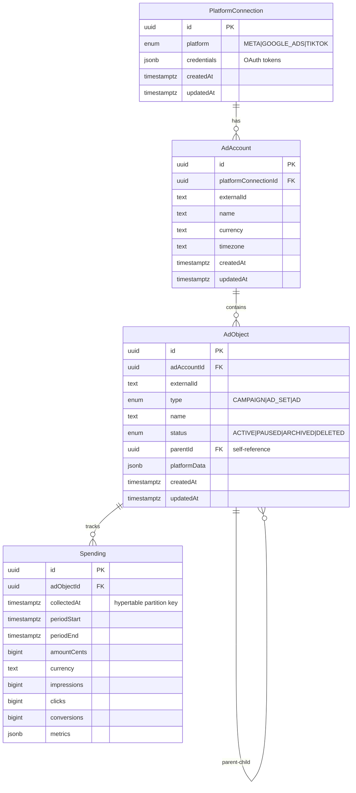

# Implement Boris Data Model

**Status:** Not started
**Created:** 2025-12-24
**Package:** `@boris/database`

## Overview

Implement the core data model for Boris, a paid media observability platform that enables marketers to sync their paid media performance data and query it through the UI. This implementation is scoped to the database package only - no API or worker modifications.

**ORM Decision:** Drizzle ORM with manual SQL migration for TimescaleDB hypertable. This is simpler than TypeORM, avoids alpha dependencies, and provides excellent type safety.

## Problem Statement

Boris needs a robust data model to:
1. Store OAuth credentials for ad platforms (META, GOOGLE_ADS, TIKTOK)
2. Track advertising account hierarchies (Campaigns > Ad Sets > Ads)
3. Capture time-series spending data with high write throughput
4. Support efficient aggregation queries across time ranges

## Technical Approach

### Architecture



### Key Technical Decisions

1. **ORM**: Drizzle ORM (already in stack, simpler, excellent types)
2. **TimescaleDB Integration**: Manual SQL migration for hypertable creation
3. **ID Strategy**: UUID for all primary keys (consistent with existing users table)
4. **Timezone Strategy**: Store all timestamps as UTC `timestamptz`
5. **No premature service layer**: Write queries inline when needed (per reviewer feedback)
6. **Minimal indexes**: Only FK indexes + unique constraints initially

## Proposed Solution

### Phase 1: Schema Files

Create Drizzle schema definitions following existing patterns.

#### 1.1 Boris Schema (All Entities)

**File:** `packages/database/src/schema/boris.ts`

```typescript
import { relations } from 'drizzle-orm';
import {
  type AnyPgColumn,
  bigint,
  index,
  jsonb,
  pgEnum,
  pgTable,
  text,
  timestamp,
  unique,
  uuid,
} from 'drizzle-orm/pg-core';

// ============================================================================
// ENUMS
// ============================================================================

export const platformEnum = pgEnum('platform', ['META', 'GOOGLE_ADS', 'TIKTOK']);
export const adObjectTypeEnum = pgEnum('ad_object_type', ['CAMPAIGN', 'AD_SET', 'AD']);
export const adObjectStatusEnum = pgEnum('ad_object_status', ['ACTIVE', 'PAUSED', 'ARCHIVED', 'DELETED']);

// ============================================================================
// PLATFORM CONNECTIONS
// ============================================================================

export const platformConnections = pgTable('platform_connections', {
  id: uuid('id').defaultRandom().primaryKey(),
  platform: platformEnum('platform').notNull(),
  credentials: jsonb('credentials').notNull(), // OAuth tokens - encrypt at app layer
  createdAt: timestamp('created_at', { withTimezone: true }).defaultNow().notNull(),
  updatedAt: timestamp('updated_at', { withTimezone: true }).defaultNow().notNull(),
});

export type PlatformConnection = typeof platformConnections.$inferSelect;
export type NewPlatformConnection = typeof platformConnections.$inferInsert;

// ============================================================================
// AD ACCOUNTS
// ============================================================================

export const adAccounts = pgTable('ad_accounts', {
  id: uuid('id').defaultRandom().primaryKey(),
  platformConnectionId: uuid('platform_connection_id')
    .notNull()
    .references(() => platformConnections.id, { onDelete: 'cascade' }),
  externalId: text('external_id').notNull(),
  name: text('name'),
  currency: text('currency').notNull(),
  timezone: text('timezone').notNull(),
  createdAt: timestamp('created_at', { withTimezone: true }).defaultNow().notNull(),
  updatedAt: timestamp('updated_at', { withTimezone: true }).defaultNow().notNull(),
}, (table) => [
  unique('ad_accounts_connection_external').on(table.platformConnectionId, table.externalId),
  index('ad_accounts_platform_connection_idx').on(table.platformConnectionId),
]);

export type AdAccount = typeof adAccounts.$inferSelect;
export type NewAdAccount = typeof adAccounts.$inferInsert;

// ============================================================================
// AD OBJECTS (Campaign > Ad Set > Ad hierarchy)
// ============================================================================

export const adObjects = pgTable('ad_objects', {
  id: uuid('id').defaultRandom().primaryKey(),
  adAccountId: uuid('ad_account_id')
    .notNull()
    .references(() => adAccounts.id, { onDelete: 'cascade' }),
  externalId: text('external_id').notNull(),
  type: adObjectTypeEnum('type').notNull(),
  name: text('name'),
  status: adObjectStatusEnum('status').notNull(),
  parentId: uuid('parent_id').references((): AnyPgColumn => adObjects.id, { onDelete: 'cascade' }),
  platformData: jsonb('platform_data'), // Raw API response data
  createdAt: timestamp('created_at', { withTimezone: true }).defaultNow().notNull(),
  updatedAt: timestamp('updated_at', { withTimezone: true }).defaultNow().notNull(),
}, (table) => [
  unique('ad_objects_account_external').on(table.adAccountId, table.externalId),
  index('ad_objects_ad_account_idx').on(table.adAccountId),
  index('ad_objects_parent_idx').on(table.parentId),
]);

export type AdObject = typeof adObjects.$inferSelect;
export type NewAdObject = typeof adObjects.$inferInsert;

// ============================================================================
// SPENDING (TimescaleDB hypertable - created via custom migration)
// ============================================================================

export const spending = pgTable('spending', {
  id: uuid('id').defaultRandom().primaryKey(),
  adObjectId: uuid('ad_object_id')
    .notNull()
    .references(() => adObjects.id, { onDelete: 'cascade' }),
  collectedAt: timestamp('collected_at', { withTimezone: true }).defaultNow().notNull(),
  periodStart: timestamp('period_start', { withTimezone: true }).notNull(),
  periodEnd: timestamp('period_end', { withTimezone: true }).notNull(),
  amountCents: bigint('amount_cents', { mode: 'bigint' }).notNull(),
  currency: text('currency').notNull(),
  impressions: bigint('impressions', { mode: 'bigint' }),
  clicks: bigint('clicks', { mode: 'bigint' }),
  conversions: bigint('conversions', { mode: 'bigint' }),
  metrics: jsonb('metrics'), // Platform-specific metrics (CTR, CPC, etc.)
}, (table) => [
  index('spending_ad_object_idx').on(table.adObjectId),
  index('spending_collected_at_idx').on(table.collectedAt),
]);

export type Spending = typeof spending.$inferSelect;
export type NewSpending = typeof spending.$inferInsert;

// ============================================================================
// RELATIONS (for Drizzle relational queries)
// ============================================================================

export const platformConnectionsRelations = relations(platformConnections, ({ many }) => ({
  adAccounts: many(adAccounts),
}));

export const adAccountsRelations = relations(adAccounts, ({ one, many }) => ({
  platformConnection: one(platformConnections, {
    fields: [adAccounts.platformConnectionId],
    references: [platformConnections.id],
  }),
  adObjects: many(adObjects),
}));

export const adObjectsRelations = relations(adObjects, ({ one, many }) => ({
  adAccount: one(adAccounts, {
    fields: [adObjects.adAccountId],
    references: [adAccounts.id],
  }),
  parent: one(adObjects, {
    fields: [adObjects.parentId],
    references: [adObjects.id],
    relationName: 'hierarchy',
  }),
  children: many(adObjects, { relationName: 'hierarchy' }),
  spending: many(spending),
}));

export const spendingRelations = relations(spending, ({ one }) => ({
  adObject: one(adObjects, {
    fields: [spending.adObjectId],
    references: [adObjects.id],
  }),
}));
```

#### 1.2 Update Schema Index

**File:** `packages/database/src/schema/index.ts`

```typescript
export * from './users.js';
export * from './boris.js';
```

### Phase 2: Generate Drizzle Migration

Run Drizzle Kit to generate the migration from schema changes:

```bash
pnpm db:generate
```

This creates the base tables. Review the generated SQL.

### Phase 3: Custom Migration for TimescaleDB Hypertable

After Drizzle generates the initial migration, create a custom SQL file to convert `spending` to a hypertable.

**File:** `packages/database/src/migrations/0002_timescaledb_spending.sql`

```sql
-- Enable TimescaleDB extension
CREATE EXTENSION IF NOT EXISTS timescaledb;

-- Convert spending table to hypertable
-- Partition by collected_at with 1-week chunks
SELECT create_hypertable(
  'spending',
  'collected_at',
  chunk_time_interval => INTERVAL '1 week',
  if_not_exists => TRUE
);

-- Add check constraint to prevent self-referential loops in ad_objects
ALTER TABLE ad_objects ADD CONSTRAINT ad_objects_no_self_parent
  CHECK (id != parent_id);
```

**Note:** Compression policy is intentionally deferred until we have real data to understand access patterns.

### Phase 4: Update Package Exports

**File:** `packages/database/src/index.ts`

```typescript
export { and, asc, desc, eq, not, or, sql } from 'drizzle-orm';
export { closeDatabase, db, pool } from './client.js';
export * from './schema/index.js';
```

No changes needed - existing exports work.

## Implementation Steps

### Step 1: Create Schema File
- [ ] Create `packages/database/src/schema/boris.ts` with all entities
- [ ] Update `packages/database/src/schema/index.ts` to export boris schema

### Step 2: Generate Drizzle Migration
- [ ] Run `pnpm db:generate` to create migration from schema
- [ ] Review generated SQL for correctness

### Step 3: Create TimescaleDB Custom Migration
- [ ] Create `0002_timescaledb_spending.sql` (or appropriate number)
- [ ] Add `CREATE EXTENSION IF NOT EXISTS timescaledb`
- [ ] Add `create_hypertable()` call for spending table
- [ ] Add self-reference check constraint for ad_objects

### Step 4: Apply Migrations
- [ ] Start TimescaleDB: `pnpm docker:up`
- [ ] Run migrations: `pnpm db:migrate`
- [ ] Verify hypertable: `SELECT * FROM timescaledb_information.hypertables;`

### Step 5: Verify Setup
- [ ] Open Drizzle Studio: `pnpm db:studio`
- [ ] Verify all tables created with correct relationships
- [ ] Test basic insert/select on each table

## Acceptance Criteria

### Functional Requirements
- [ ] All schema compiles without TypeScript errors
- [ ] `pnpm db:generate` creates valid migration
- [ ] `pnpm db:migrate` applies migration successfully
- [ ] TimescaleDB extension enabled
- [ ] Spending table converted to hypertable
- [ ] Drizzle Studio shows all tables

### Quality Gates
- [ ] UUID primary keys on all entities (matches existing users table)
- [ ] Foreign key constraints with CASCADE delete
- [ ] Unique constraints on external IDs
- [ ] Self-referential relation for AdObject hierarchy works
- [ ] All types exported (`$inferSelect`, `$inferInsert`)

## Files to Create/Modify

| File | Action | Description |
|------|--------|-------------|
| `packages/database/src/schema/boris.ts` | Create | All Boris entities in one file |
| `packages/database/src/schema/index.ts` | Modify | Export boris schema |
| `packages/database/src/migrations/0002_*.sql` | Create | TimescaleDB hypertable setup |

## What We're NOT Building (Per Reviewer Feedback)

1. **No spending service layer** - Write queries inline in API/worker when needed
2. **No premature indexes** - Only FK indexes + unique constraints initially
3. **No compression policy yet** - Add when we have real data
4. **No TypeORM** - Drizzle is simpler and already in the stack
5. **No type interfaces for JSONB** - Runtime is untyped anyway, add when OAuth is implemented

## Dependencies & Prerequisites

- TimescaleDB running via Docker (`pnpm docker:up`)
- Existing database package with Drizzle ORM
- Node.js 20+ with ESM support

## Risk Analysis

| Risk | Likelihood | Impact | Mitigation |
|------|------------|--------|------------|
| TimescaleDB hypertable creation fails | Low | High | Test on clean DB; verify extension loaded |
| Self-referential FK causes issues | Low | Medium | Use `AnyPgColumn` type; test hierarchy |
| Raw SQL for time_bucket needed | Expected | Low | Document patterns; use `sql` template |

## Future Considerations (Separate Tickets)

1. **Encryption**: Credentials encryption at app layer
2. **Compression**: Add policy after collecting real data (~30 days)
3. **Continuous Aggregates**: Pre-computed rollups when dashboards are slow
4. **Retention Policy**: Automatic data cleanup for compliance
5. **Additional Indexes**: Based on actual slow queries

## TimescaleDB Query Patterns

When building the API/worker, use these patterns for TimescaleDB features:

```typescript
import { sql } from 'drizzle-orm';
import { db } from '@boris/database';

// Time bucket aggregation
const dailySpending = await db.execute(sql`
  SELECT
    time_bucket('1 day', period_start) as bucket,
    ad_object_id,
    SUM(amount_cents) as total_cents,
    SUM(impressions) as total_impressions
  FROM spending
  WHERE ad_object_id = ${adObjectId}
    AND period_start >= ${startDate}
    AND period_start < ${endDate}
  GROUP BY bucket, ad_object_id
  ORDER BY bucket DESC
`);

// Get latest spending per period (deduplication)
const latestSpending = await db.execute(sql`
  SELECT DISTINCT ON (period_start)
    id, ad_object_id, collected_at, period_start, period_end,
    amount_cents, currency, impressions, clicks, conversions
  FROM spending
  WHERE ad_object_id = ${adObjectId}
    AND period_start >= ${startDate}
  ORDER BY period_start, collected_at DESC
`);
```

## References

### Internal
- Existing schema pattern: `packages/database/src/schema/users.ts`
- Database client: `packages/database/src/client.ts`
- Drizzle config: `packages/database/drizzle.config.ts`

### External
- [Drizzle ORM Relations](https://orm.drizzle.team/docs/relations)
- [Drizzle Self-Referential FK](https://orm.drizzle.team/docs/indexes-constraints#foreign-key)
- [TimescaleDB Hypertables](https://docs.timescale.com/use-timescale/latest/hypertables/)
- [TimescaleDB time_bucket](https://docs.timescale.com/api/latest/hyperfunctions/time_bucket/)
