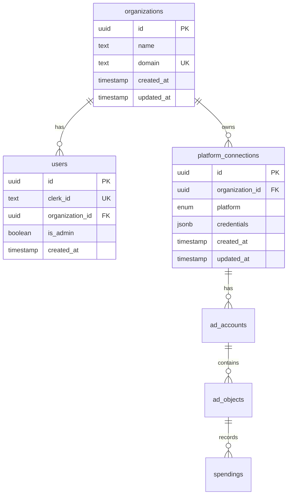

# feat: User & Organization Data Model

## Overview

Design and implement the user and organization model that enables agencies to manage their team members and platform connections under a unified account structure. This is the multi-tenant foundation for Boris.

**Type**: Feature
**Priority**: Critical
**Status**: Not started

---

## Problem Statement / Motivation

Boris currently has no concept of organizations or user management. Platform connections exist independently without ownership, making it impossible to:

- Support multiple agencies/companies using the platform
- Control who can access which ad accounts and data
- Implement proper role-based access control
- Scope data access to specific organizations

This feature establishes the multi-tenant foundation required before any production use.

---

## Proposed Solution

Implement a simple multi-tenant data model with:

1. **Organizations** - Agencies that own platform connections and ad accounts
2. **Users** - Minimal local records linking Clerk users to organizations
3. **Two roles** - Admin (can manage) and Member (can view)
4. **Organization-scoped queries** - All data access filtered by organization

---

## Technical Approach

### Architecture



### Key Design Decisions

| Decision | Choice | Rationale |
|----------|--------|-----------|
| User-Org relationship | One-to-one (FK on users) | Simpler than junction table, covers 99% of use cases |
| Roles | Boolean `isAdmin` | Two permission levels (admin/member) are sufficient |
| User data storage | Minimal (clerk_id only) | Get name/email from Clerk at runtime |
| Domain auto-linking | Defer to Phase 2 | Start with manual org assignment via DB |

---

## Implementation Phases

### Phase 1: Schema, Migration & Webhook

Create database tables and sync users from Clerk.

**Tasks:**

- [ ] Create `organizations` table with name, domain (unique)
- [ ] Create `users` table with clerkId (unique), organizationId, isAdmin
- [ ] Add `organizationId` FK to `platform_connections` (NOT NULL)
- [ ] Add Drizzle relations for new tables
- [ ] Generate and run migrations
- [ ] Add `CLERK_WEBHOOK_SIGNING_SECRET` to environment
- [ ] Create webhook route at `POST /api/webhooks/clerk`
- [ ] Mount webhooks BEFORE auth middleware
- [ ] Handle `user.created` - create minimal user record
- [ ] Handle `user.deleted` - remove user record
- [ ] Create seed organization for existing data
- [ ] Migrate existing `platform_connections` to seed org

**Files to create/modify:**

- `packages/database/src/schema/boris.ts` - Add tables and relations
- `apps/api/src/routes/webhooks.ts` - Webhook handler
- `apps/api/src/index.ts` - Mount webhooks before auth

**Schema:**

```typescript
// packages/database/src/schema/boris.ts

export const organizations = pgTable('organizations', {
  id: uuid('id').defaultRandom().primaryKey(),
  name: text('name').notNull(),
  domain: text('domain').unique(),
  createdAt: timestamp('created_at', { withTimezone: true }).defaultNow().notNull(),
  updatedAt: timestamp('updated_at', { withTimezone: true }).defaultNow().notNull(),
});

export const users = pgTable('users', {
  id: uuid('id').defaultRandom().primaryKey(),
  clerkId: text('clerk_id').notNull().unique(),
  organizationId: uuid('organization_id').references(() => organizations.id, { onDelete: 'set null' }),
  isAdmin: boolean('is_admin').notNull().default(false),
  createdAt: timestamp('created_at', { withTimezone: true }).defaultNow().notNull(),
}, (table) => [
  index('users_clerk_id_idx').on(table.clerkId),
  index('users_organization_id_idx').on(table.organizationId),
]);

export type Organization = typeof organizations.$inferSelect;
export type NewOrganization = typeof organizations.$inferInsert;
export type User = typeof users.$inferSelect;
export type NewUser = typeof users.$inferInsert;

// Relations
export const organizationsRelations = relations(organizations, ({ many }) => ({
  users: many(users),
  platformConnections: many(platformConnections),
}));

export const usersRelations = relations(users, ({ one }) => ({
  organization: one(organizations, {
    fields: [users.organizationId],
    references: [organizations.id],
  }),
}));

// Update existing platformConnections - add organizationId
// organizationId: uuid('organization_id').notNull().references(() => organizations.id, { onDelete: 'cascade' }),

// Update platformConnectionsRelations
export const platformConnectionsRelations = relations(
  platformConnections,
  ({ one, many }) => ({
    organization: one(organizations, {
      fields: [platformConnections.organizationId],
      references: [organizations.id],
    }),
    adAccounts: many(adAccounts),
  })
);
```

**Webhook handler:**

```typescript
// apps/api/src/routes/webhooks.ts
import type { WebhookEvent, UserJSON, DeletedObjectJSON } from '@clerk/express/webhooks';
import { verifyWebhook } from '@clerk/express/webhooks';
import { Router } from 'express';
import express from 'express';
import { db } from '@boris/database';
import { users } from '@boris/database/schema';
import { eq } from 'drizzle-orm';

export const webhooksRouter = Router();

webhooksRouter.post(
  '/clerk',
  express.raw({ type: 'application/json' }),
  async (req, res) => {
    let evt: WebhookEvent;

    try {
      evt = await verifyWebhook(req);
    } catch (error) {
      console.error('Webhook signature verification failed:', error);
      return res.status(400).json({ error: 'Invalid webhook signature' });
    }

    try {
      switch (evt.type) {
        case 'user.created': {
          const userData = evt.data as UserJSON;
          await db.insert(users).values({
            clerkId: userData.id,
            // organizationId is null - assign manually or implement auto-linking later
            isAdmin: false,
          }).onConflictDoNothing();
          break;
        }
        case 'user.deleted': {
          const deletedData = evt.data as DeletedObjectJSON;
          if (deletedData.id) {
            await db.delete(users).where(eq(users.clerkId, deletedData.id));
          }
          break;
        }
      }
    } catch (error) {
      console.error(`Webhook handler error for ${evt.type}:`, error);
      // Still return 200 - Clerk will retry on non-2xx
    }

    return res.json({ received: true });
  }
);
```

**Express app setup:**

```typescript
// apps/api/src/index.ts

// Mount webhooks BEFORE any auth middleware (needs raw body)
app.use('/api/webhooks', webhooksRouter);

// Then standard middleware
app.use(express.json());
app.use(clerkMiddleware());
// ... rest of routes
```

---

### Phase 2: Auth Middleware & Query Scoping

Add organization context to requests and scope all queries.

**Tasks:**

- [ ] Add Express type definitions for `req.user` and `req.organization`
- [ ] Create `requireOrgMember` middleware (auth + user + org + admin check)
- [ ] Add `ForbiddenError` to error classes
- [ ] Update `getAccountsWithSpending` to filter by organizationId
- [ ] Update `getAccountById` to verify org ownership
- [ ] Update ad-accounts route to use new middleware
- [ ] Update sync route to use new middleware
- [ ] Add `GET /api/organizations/current` route
- [ ] Write authorization tests

**Files to create/modify:**

- `apps/api/src/types/express.d.ts` - Type extensions
- `apps/api/src/middleware/auth.ts` - Add `requireOrgMember`
- `apps/api/src/lib/errors.ts` - Add `ForbiddenError`
- `packages/database/src/queries/analytics.ts` - Add org filtering
- `apps/api/src/routes/ad-accounts.ts` - Use new middleware
- `apps/api/src/routes/organizations.ts` - Current org route

**Type definitions:**

```typescript
// apps/api/src/types/express.d.ts

declare global {
  namespace Express {
    interface Request {
      user?: {
        id: string;
        clerkId: string;
        isAdmin: boolean;
      };
      organization?: {
        id: string;
        name: string;
      };
    }
  }
}

export {};
```

**Single middleware:**

```typescript
// apps/api/src/middleware/auth.ts
import { getAuth } from '@clerk/express';
import type { RequestHandler } from 'express';
import { db } from '@boris/database';
import { users } from '@boris/database/schema';
import { eq } from 'drizzle-orm';
import { UnauthorizedError, ForbiddenError } from '../lib/errors.js';

export const requireAuth: RequestHandler = (req, _res, next) => {
  const auth = getAuth(req);
  if (!auth?.userId) {
    throw new UnauthorizedError('Authentication required');
  }
  next();
};

/**
 * Combined middleware: authenticates, loads user + org context, optionally requires admin
 */
export function requireOrgMember(options: { adminOnly?: boolean } = {}): RequestHandler {
  return async (req, _res, next) => {
    const auth = getAuth(req);
    if (!auth?.userId) {
      throw new UnauthorizedError('Authentication required');
    }

    const user = await db.query.users.findFirst({
      where: eq(users.clerkId, auth.userId),
      with: { organization: true },
    });

    if (!user) {
      throw new UnauthorizedError('User not found');
    }

    if (!user.organizationId || !user.organization) {
      throw new ForbiddenError('No organization access');
    }

    if (options.adminOnly && !user.isAdmin) {
      throw new ForbiddenError('Admin access required');
    }

    req.user = {
      id: user.id,
      clerkId: user.clerkId,
      isAdmin: user.isAdmin,
    };

    req.organization = {
      id: user.organization.id,
      name: user.organization.name,
    };

    next();
  };
}
```

**Error class:**

```typescript
// apps/api/src/lib/errors.ts (add this class)
export class ForbiddenError extends AppError {
  constructor(message = 'Permission denied') {
    super(message, 403, 'FORBIDDEN');
  }
}
```

**Query updates:**

```typescript
// packages/database/src/queries/analytics.ts
export async function getAccountsWithSpending(
  startDate: Date,
  endDate: Date,
  organizationId: string,
): Promise<AccountWithSpending[]> {
  return db
    .select({
      // ... existing fields
    })
    .from(adAccounts)
    .innerJoin(platformConnections, eq(adAccounts.platformConnectionId, platformConnections.id))
    .leftJoin(spendings, /* ... */)
    .where(
      and(
        eq(platformConnections.organizationId, organizationId), // FILTER BY ORG
        gte(spendings.date, startDate),
        lte(spendings.date, endDate),
      )
    )
    // ... rest of query
}
```

**Route updates:**

```typescript
// apps/api/src/routes/ad-accounts.ts
import { requireOrgMember } from '../middleware/auth.js';

export const adAccountsRouter = Router();

adAccountsRouter.get(
  '/',
  requireOrgMember(),
  asyncHandler(async (req, res) => {
    const { startDate, endDate } = dateRangeSchema.parse(req.query);
    const accounts = await getAccountsWithSpending(
      startDate,
      endDate,
      req.organization!.id, // Org guaranteed by middleware
    );
    res.json({ data: accounts });
  })
);
```

**Organizations route:**

```typescript
// apps/api/src/routes/organizations.ts
import { Router } from 'express';
import { requireOrgMember } from '../middleware/auth.js';
import { asyncHandler } from '../lib/async-handler.js';

export const organizationsRouter = Router();

organizationsRouter.get(
  '/current',
  requireOrgMember(),
  asyncHandler(async (req, res) => {
    res.json({
      data: {
        id: req.organization!.id,
        name: req.organization!.name,
        role: req.user!.isAdmin ? 'admin' : 'member',
      },
    });
  })
);
```

---

## Acceptance Criteria

### Functional Requirements

- [ ] Organization table created with name, domain (unique)
- [ ] User table with clerkId (unique), organizationId, isAdmin
- [ ] Clerk webhook syncs user creation/deletion
- [ ] PlatformConnection has organizationId FK (NOT NULL)
- [ ] All data queries scoped by organization
- [ ] Admin-only routes reject non-admin users
- [ ] Users without organization see "No organization access" error

### Non-Functional Requirements

- [ ] Organization context lookup < 50ms p99
- [ ] Webhook processing < 1s
- [ ] No cross-organization data leakage

### Quality Gates

- [ ] Integration tests for webhook handling
- [ ] Authorization tests: admin vs member access
- [ ] Cross-org data isolation test
- [ ] Migration tested with rollback

---

## Deferred to Future Iterations

| Feature | Rationale |
|---------|-----------|
| Domain auto-linking | Manual assignment simpler for MVP |
| Member management UI | Manage via DB for now |
| Invitation system | Not needed without auto-linking |
| Multiple domains per org | YAGNI |
| OWNER role distinct from ADMIN | Same permissions |
| Organization slug | No URL routing planned |
| Sync user profile data (name, email) | Available from Clerk at runtime |

---

## Migration Strategy

Since Boris is pre-production:

1. Create migration adding all new tables/columns as NOT NULL where appropriate
2. Seed a default organization in the migration
3. Update existing `platform_connections` to reference seed org
4. No nullable dance needed

```sql
-- Migration pseudocode
CREATE TABLE organizations (...);
CREATE TABLE users (...);

-- Seed org
INSERT INTO organizations (id, name)
VALUES ('00000000-0000-0000-0000-000000000001', 'Default Organization');

-- Add column to platform_connections
ALTER TABLE platform_connections
ADD COLUMN organization_id UUID NOT NULL
DEFAULT '00000000-0000-0000-0000-000000000001'
REFERENCES organizations(id);

-- Remove default after backfill
ALTER TABLE platform_connections ALTER COLUMN organization_id DROP DEFAULT;
```

---

## Test Scenarios

```typescript
describe('Organization Scoping', () => {
  it('should not return data from other organizations', async () => {
    // Setup: User A in Org A, User B in Org B with platform connections
    // Action: User A requests ad accounts
    // Assert: Only Org A accounts returned
  });

  it('should deny access to users without organization', async () => {
    // Setup: User exists in DB but organizationId is null
    // Action: Request any protected route
    // Assert: 403 "No organization access"
  });

  it('should deny non-admin from admin routes', async () => {
    // Setup: User with isAdmin=false
    // Action: Request admin-only route
    // Assert: 403 "Admin access required"
  });
});

describe('Clerk Webhook', () => {
  it('should create user on user.created event', async () => {
    // Setup: Valid webhook payload
    // Action: POST /api/webhooks/clerk
    // Assert: User record created with null organizationId
  });

  it('should be idempotent for duplicate events', async () => {
    // Action: Send same user.created twice
    // Assert: No error, single user record
  });

  it('should reject invalid signatures', async () => {
    // Action: POST with invalid signature
    // Assert: 400 error
  });
});
```

---

## References

### Internal References

- Existing schema: `packages/database/src/schema/boris.ts`
- Current auth middleware: `apps/api/src/middleware/auth.ts:1-17`
- Query patterns: `packages/database/src/queries/analytics.ts`

### External References

- [Clerk Webhooks](https://clerk.com/docs/webhooks/overview)
- [Clerk Express SDK](https://clerk.com/docs/getting-started/quickstart/expressjs)
- [Drizzle ORM Relations](https://orm.drizzle.team/docs/relations)

### Related Work

- Notion Ticket: [User & Organization Data Model](https://www.notion.so/imrl/2d7e038049d98117809de32a2574323d)
